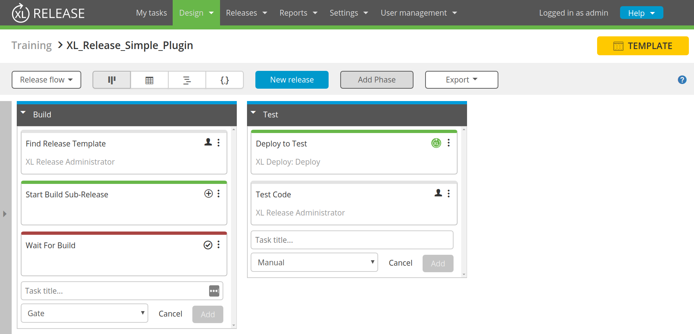

# XL Release Simple Plugin

## Problem Statement
Acme Corporation has a simple Build and Test template ([Template](templates/XL_Release_Simple_Plugin.groovy)):

As you can see in the template, a user manually finds a template for the sub-release and then has to input that into the "Start Build Sub-Release" task.

In this exercise, create a plugin with a custom automated task that replaces the "Find Release Template" manual task, and does the following:
- Takes the name of a template to search for.
- Locates the XL Release Template with the specified name.
- Outputs the ID of that Template so it can be stored in a variable and used by the "Start Build Sub-Release" task.
